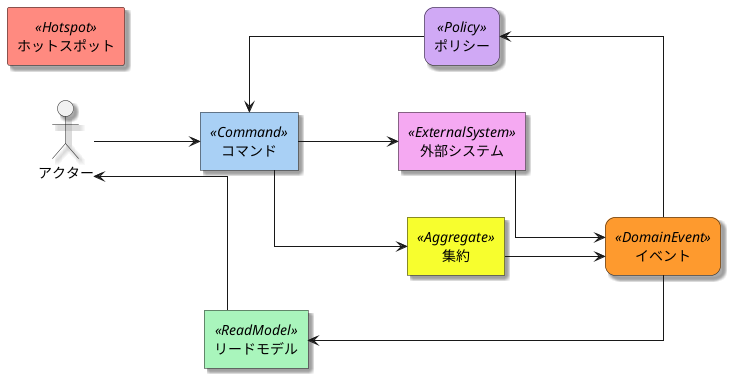
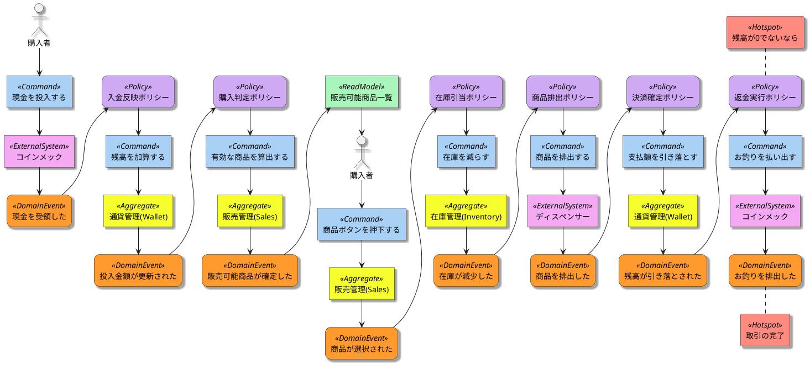
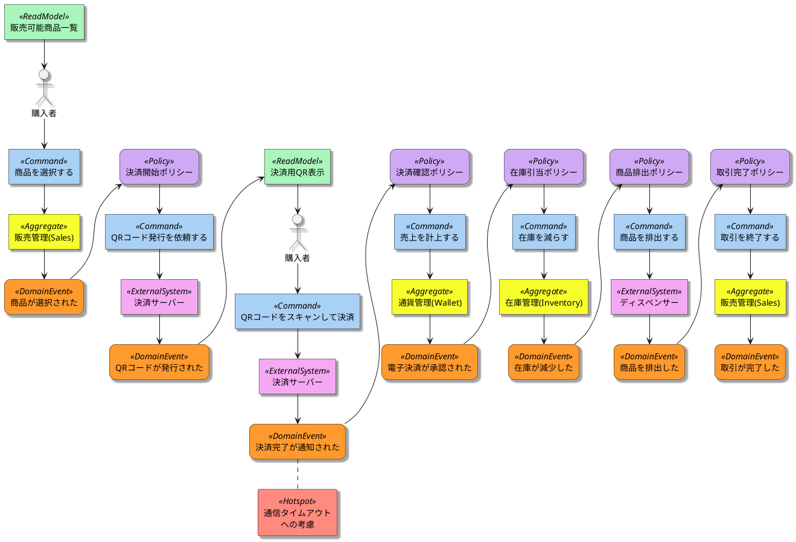
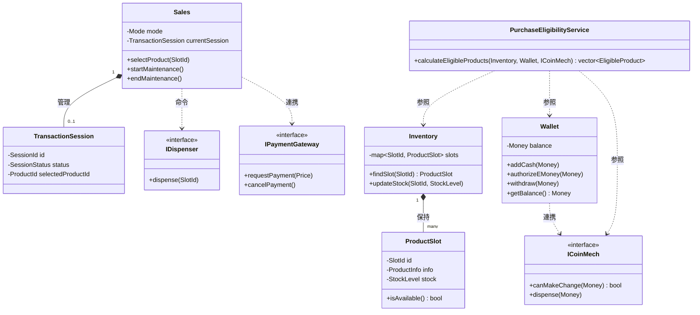

# 自動販売機システム：ドメイン駆動設計（DDD）のサンプル

## 0. プロジェクト概要

このプロジェクトは、**ドメイン駆動設計（DDD）の実装パターンを学習・比較** するための実装サンプルです。同じドメイン（自動販売機）を異なるアーキテクチャで実装し、各パターンの特性を理解できます。

### 実装済みのアーキテクチャ

| アーキテクチャ | ディレクトリ | 特徴 |
| --- | --- | --- |
| **Layered** | `layered_architect/` | 層状アーキテクチャ。シンプルで理解しやすい。 |
| **Clean** | `clean_architect/` | 中心にビジネスロジック。外層に適応性を確保。 |
| **Onion** | `onion_architect/` | 同心円層。依存性を中心に向かって一方向。 |
| **Hexagonal** | `hexagonal_architect/` | ポートとアダプター。バウンダリを明確に分離。 |

### 実装の特徴

✅ **DDD原則の実装**
- Value Objects (Money, Price, Quantity, ProductInfo, SlotId)
- Entities (ProductSlot)
- Aggregates (Inventory, PaymentSystem)
- Domain Services

✅ **デザインパターン**
- Dependency Injection
- Repository Pattern
- Value Object Pattern
- Aggregate Pattern

✅ **テスト駆動開発**
- Google Test による包括的なテストスイート
- 全アーキテクチャで165以上のテストケース

✅ **コード品質**
- Doxygen 形式のコメント
- header-only から .cpp への実装分割
- CMake による統一的なビルド管理

---

## 1. 要件定義

### ビジネスゴール

「現金および電子決済に対応し、在庫と売上をリアルタイムに管理できる、高機能かつメンテナンス性に優れた自動販売機システムの構築」

### 機能要件

* **購入者向け**
  * **現金決済:** 硬貨・紙幣の投入、投入金額の表示。
  * **電子決済:** QRコードを用いた外部決済連携。
  * **購入判定:** 在庫、投入金額、お釣り準備状況に基づく購入可能商品の提示。
  * **商品排出:** 決済完了後の商品払い出しと在庫更新。
  * **お釣り:** 返金レバーまたは購入後の自動払い出し。

* **オーナー（管理者）向け**
  * **在庫管理:** 商品の補充、売り切れ状態の管理。
  * **売上管理:** 決済手段別の売上集計・レポート。
  * **価格設定:** 商品価格の変更（入金中であっても反映）。
  * **現金回収:** 収納された現金の取り出しとシステム数値のリセット。

### 非機能要件・制約

* **DIPの徹底:** コインメック等の物理デバイスはインターフェースを介して抽象化し、エミュレータでの動作を可能にする。
* **物理故障の扱い:** 商品詰まり等の物理障害は本モデルの範囲外とし、「排出命令＝成功」と定義する。

---

## 前提条件

* CMake 3.x 以上
* C++17 対応コンパイラ (clang, g++など)
* Google Test (自動でダウンロード)

---

## ビルド・実行・テスト方法

### 全アーキテクチャ

```bash
# ビルドスクリプトで全て実行
./build.sh

# または手動実行
# Layered Architecture
cmake -S layered_architect -B build/layered && cmake --build build/layered
ctest --test-dir build/layered

# Clean Architecture
cmake -S clean_architect -B build/clean && cmake --build build/clean
ctest --test-dir build/clean

# Onion Architecture
cmake -S onion_architect -B build/onion && cmake --build build/onion
ctest --test-dir build/onion

# Hexagonal Architecture
cmake -S hexagonal_architect -B build/hex && cmake --build build/hex
ctest --test-dir build/hex
```

### 実行例

```bash
# Layered Architecture
./build/layered/vending_machine_app

# Clean Architecture
./build/clean/vending_machine_clean

# Onion Architecture
./build/onion/vending_machine_onion

# Hexagonal Architecture
./build/hex/vending_machine_hex
```

---

## 2. ユビキタス言語

| 用語 | 英語表記 | 定義・役割 | 分類 |
| --- | --- | --- | --- |
| **販売管理** | **Sales** | 取引（セッション）のライフサイクル、通常/メンテナンスモードの切り替えを司る。 | 集約 (Aggregate) |
| **通貨管理** | **Wallet** | 現金残高、電子決済の承認状態、および出金・返金ロジックを管理する。 | 集約 (Aggregate) |
| **在庫管理** | **Inventory** | スロットごとの在庫数、商品割り当て、補充・減算を管理する。 | 集約 (Aggregate) |
| **商品** | **Product** | 販売される飲料。識別子(ID)、名前、価格を保持する。 | 値オブジェクト |
| **残高** | **Balance** | 利用者が現在商品購入に利用できる有効な金額。 | Walletの属性 |
| **販売可能商品一覧** | **Available Products** | 在庫状況、価格、および釣銭準備状況を統合した最新データ。現金モードでは「即時購入可否」の提示に、電子決済では「選択対象」の提示に用いられる。 | リードモデル (Read Model) |
| **購入可能判定** | **Purchase Eligibility** | 商品が販売可能かを判断するロジック。決済コンテキストに応じ、「在庫」「残高」「釣銭」の各条件を組み合わせて適用される。 | ドメインルール / Policy |
| **在庫あり** | **In Stock** | 商品スロットに1本以上の在庫が存在し、物理的な払い出しが可能な状態。決済手段を問わない共通の必須条件。 | ビジネスルール (判定条件) |
| **残高十分** | **Sufficient Balance** | 現金投入額、または電子決済承認額が商品の販売価格以上である状態。 | ビジネスルール (判定条件) |
| **釣銭準備OK** | **Change Ready** | 該当商品を購入した際に発生するお釣りを、コインメックが物理的に払い出し可能である状態（現金決済時のみ評価される）。 | ビジネスルール (判定条件) |
| **有効な商品** | **Eligible Product** | 購入可能判定（Purchase Eligibility）のすべての条件（在庫・残高・釣銭）を満たし、利用者にとって選択可能な状態にある商品。 | ビジネスルール (評価結果) |
| **通常モード** | **Normal Mode** | 購入者が利用可能な状態。メンテナンス中は入ることができない。 | システム状態 |
| **メンテナンスモード** | **Maintenance Mode** | オーナーが価格変更や補充を行う状態。購入者の操作は一切受け付けない。 | システム状態 |
| **コインメック** | **CoinMech** | 現金の受入、真贋判定、保管、物理的な払い出しを行う物理デバイス。 | 外部システム |
| **ディスペンサー** | **Dispenser** | 商品を物理的に搬出する物理デバイス。排出命令＝成功と定義される。 | 外部システム |
| **決済サーバー** | **Payment Server** | QRコード決済の認証、決済承認、通知を司る外部プラットフォーム。 | 外部システム |


---

## 3. ユースケース図

```plantuml
left to right direction
skinparam packageStyle rectangle

actor "購入者" as Buyer
actor "オーナー" as Admin
actor "決済サーバー" as PaymentServer

rectangle "自動販売機システム" {
  usecase "現金で商品を購入する" as UC1
  usecase "電子マネーで商品を購入する" as UC2
  usecase "投入金額を返金する" as UC3
  usecase "商品を補充する" as UC4
  usecase "現金を回収する" as UC5
  usecase "商品価格を設定する" as UC6
  usecase "売上レポートを確認する" as UC7
}

Buyer --> UC1
Buyer --> UC2
Buyer --> UC3
UC2 -- PaymentServer
Admin --> UC4
Admin --> UC5
Admin --> UC6
Admin --> UC7
```

---

## 4. プロセスモデリング

### イベントストーミングのルール



### 現金で商品を購入する:ハッピーパス




### 電子マネーで商品を購入する:ハッピーパス



---

## 5. ドメインモデル
これまでのイベントストーミングの議論と、洗練されたユビキタス言語に基づき、ドメインモデルを全面的に再構築しました。

以前のモデルでは「自動販売機」という巨大な集約に責務が集中していましたが、最新のモデルでは**「Sales（販売管理）」「Wallet（通貨管理）」「Inventory（在庫管理）」**の3つの集約に分割し、それぞれの責務と不変条件を明確に定義しています。

---

## 5. ドメインモデル

### 集約 (Aggregates)

* **Sales (販売管理集約)**:
  * **責務**: 取引（セッション）のライフサイクル管理と、システムモード（通常/メンテナンス）の切り替えを司る。
  * **Entity**: `TransactionSession`（取引ID、現在のステータス、選択された商品を保持）。
  * **不変条件**: メンテナンスモード中は購入者による取引を開始できない。一つのセッションが進行している間、他の商品選択は排他制御される。

* **Wallet (通貨管理集約)**:
  * **責務**: 投入された現金の計上、電子決済の承認金額の保持、および出金・返金ロジックの管理。
  * **Attribute**: `Balance`（投入された現金と承認済み電子マネーの合算残高）。
  * **不変条件**: 残高（Balance）は負の値にならない。お釣りの払い出しは、コインメックの物理的な保持状況を超えて実行できない。

* **Inventory (在庫管理集約)**:
  * **責務**: 物理的なスロットへの商品割り当てと、在庫数の増減を管理。
  * **Entity**: `ProductSlot`（スロット識別子、現在の在庫数、割り当てられた商品情報を保持）。
  * **不変条件**: 在庫数は0未満にならず、各スロットの最大収容数を超えない。

### 値オブジェクト (Value Objects)

* **Money**: 金額計算（加算・減算）のロジックを内包し、不変性（Immutable）を保証する。計算結果は常に新しいインスタンスとして返される。
* **Price**: 商品の販売価格。負の値を取らないという制約を持ち、ビジネスルール上の「価格」としての性質を表現する。
* **StockLevel**: 在庫数を表す不変の値。0（売り切れ）から最大収容数までの範囲制約を持つ。
* **ProductInfo**: 商品の識別子(ID)、名前、価格を一つにまとめたもの。商品マスタとしての基礎情報を表現する。
* **EligibleProduct**: 商品情報に加え、現在の残高・在庫・釣銭状況に照らして「その利用者が購入可能である」という論理的な適格性を付与されたオブジェクト。

### ドメインサービス (Domain Services)

* **PurchaseEligibilityService (購入適格性判定サービス)**:
  * **責務**: 複数の集約（Inventory, Wallet, Sales）から情報を集約し、現在の状況で「有効な商品(Eligible Product)」がどれかを判定する。
  * **ロジック**: 「在庫(StockLevel) > 0」かつ「残高(Balance) >= 価格(Price)」かつ「釣銭準備OK」のすべてのルールを評価する。このサービスの結果が、リードモデル（販売可能商品一覧）の更新ソースとなる。


### 外部システムとの境界 (Infrastructure / Ports)

* **外部インターフェース**:
  * `ICoinMech`（コインメック操作）、`IDispenser`（商品排出操作）、`IPaymentGateway`（電子決済通信）。
  * これらはドメインモデルの外側に位置し、DIP（依存性逆転の原則）に基づいて抽象化される。ドメインモデル（各集約）はこれらのインターフェースを介して物理デバイスや外部サーバーへ命令を送るが、デバイスの具体的な制御ロジックには依存しない。


---

## 6. クラス図



### 集約 (Aggregates) とエンティティ

| クラス名 | 分類 | 責務（Responsibility） |
| --- | --- | --- |
| **Sales** | 集約ルート | **進行管理の司令塔。** <br> システムの状態（通常モード/メンテナンスモード）を管理し、取引の開始から終了までのライフサイクルを制御する。 |
| **TransactionSession** | エンティティ | **一連の取引の記憶。** <br> 現在進行中の取引において、「誰が」「何を」「どの状態まで」進めたかを保持する。 |
| **Wallet** | 集約ルート | **価値（通貨）の守護者。** <br>投入された現金や電子マネーの承認額を合算して「残高」を管理する。出金命令を受け、整合性を保ちながら残高を減らす。 |
| **Inventory** | 集約ルート | **棚卸しの責任者。** <br>自販機内の全スロットを把握し、在庫の増減が正しく行われることを保証する。 |
| **ProductSlot** | エンティティ | **物理配置の表現。** <br>特定の場所に紐づく「商品情報」と「現在の個数」を管理する。 |

---

### 値オブジェクト (Value Objects)

値オブジェクトは、それ自体が交換可能であり、ビジネスルールを内包する「計測・記述」のためのクラスです。

| クラス名 | 責務（Responsibility） |
| --- | --- |
| **Money / Price** | **金額計算の正当性。** <br> 加減算の結果が負にならないことや、通貨単位の整合性を保証する。 |
| **StockLevel** | **在庫数の境界管理。** <br>「0（売り切れ）」から「最大収容数」までの範囲を保証する。 |
| **ProductInfo** | **商品定義の不変性。** <br> 名前や本来の価格など、マスタとしての情報をひとまとめにする。 |
| **EligibleProduct** | **一時的な適格性の提示。** <br> 判定時点において「残高・在庫・釣銭」の条件をパスしたという事実をカプセル化する。 |

---

### ドメインサービス (Domain Services)

集約を跨ぐ複雑な判定ロジックを扱います。

| クラス名 | 責務（Responsibility） |
| --- | --- |
| **PurchaseEligibilityService** | **購入可否の最終判断。** <br>`Wallet`の残高、`Inventory`の在庫、`ICoinMech`の釣銭状況を統合し、現在どの商品が「有効（Eligible）」かを判定するロジックを担う。 |

---

### 外部システム・インターフェース (Ports)

物理デバイスとの境界を抽象化し、ドメイン層をクリーンに保ちます。

| クラス名 | 責務（Responsibility） |
| --- | --- |
| **ICoinMech** | **物理通貨のハンドリング。** <br> 物理的な硬貨の有無（釣銭準備状況）の報告と、物理的な払い出し命令の受諾。 |
| **IDispenser** | **商品の物理搬出。** <br> 指定されたスロットから商品を1本出すという物理アクションの実行。 |
| **IPaymentGateway** | **外部決済プラットフォームとの通信。** <br> QRコード発行依頼、決済承認の待受、およびキャンセル通信の実行。 |


---

## 7. 実装の詳細

### ProductInfo Value Object

全アーキテクチャで統一された設計。商品名と金額を完全に保持する不変の値オブジェクト。

```cpp
class ProductInfo {
 public:
  ProductInfo(std::string name, const Price& price)
      : name_(std::move(name)), price_(price) {}
  
  const std::string& getName() const { return name_; }
  const Price& getPrice() const { return price_; }
 
 private:
  std::string name_;
  Price price_;
};
```

**利点:**
- 商品情報を一体のオブジェクトとして管理
- 価格変更が全体に反映される（参照の一貫性）
- ProductSlot のコンストラクタが簡潔（3パラメータ）

### ProductSlot Entity - Header/Implementation 分割

ヘッダーファイル `.hpp` と実装ファイル `.cpp` に分割。インターフェースは hpp に、ビジネスロジックは cpp に配置。

**ProductSlot.hpp** - 宣言のみ
```cpp
class ProductSlot {
 public:
  ProductSlot(SlotId id, const ProductInfo& info, Quantity stock);
  
  void dispense();
  void refill(Quantity amount);
  bool canDispense() const { return !stock_.isZero(); }
 
 private:
  SlotId id_;
  ProductInfo info_;
  Quantity stock_;
};
```

**ProductSlot.cpp** - 実装
```cpp
void ProductSlot::dispense() {
  if (!canDispense()) {
    throw std::domain_error("Cannot dispense: out of stock.");
  }
  stock_ = stock_.decrease();
}

void ProductSlot::refill(Quantity amount) {
  stock_ = stock_.increase(amount);
}
```

**設計の利点:**
- クラス定義と実装の責任を分離
- ヘッダーサイズを削減
- テンプレートでない実装も明確に分離

### DTO パターン - UI とドメイン層の結合度を下げる

DTO（Data Transfer Object）を用いて、プレゼンテーション層とドメイン層を分離。

```cpp
// Domain Model
class ProductSlot {
  // ... complex domain logic
};

// DTO - UI向けデータ構造
struct SlotView {
  int id;
  std::string name;
  int price;
  std::string status;  // "in_stock", "out_of_stock"
};

struct DashboardView {
  int balance;
  std::vector<SlotView> slots;
};

// Application Service - ドメインモデルから DTO に変換
class VendingAppService {
 public:
  DashboardView getDashboard() const {
    DashboardView view;
    view.balance = paymentSystem_.getCurrentBalance().getRawValue();
    for (const auto& slot : inventory_.getSlots()) {
      view.slots.push_back({
        slot.getId().getValue(),
        slot.getInfo().getName(),
        slot.getInfo().getPrice().getRawValue(),
        slot.canDispense() ? "in_stock" : "out_of_stock"
      });
    }
    return view;
  }
};
```

**メリット:**
- UI が直接ドメインモデルに依存しない
- ドメイン層の変更が UI に波及しない
- UI 層で必要な情報のみを選択できる

---

## 8. テスト戦略

### テスト構成

全アーキテクチャで統一されたテスト構成：

```
test/
├── domain/          # ドメイン層のユニットテスト
│   ├── common/      # Money, Price, Quantity など
│   ├── inventory/   # Inventory, ProductSlot
│   └── payment/     # PaymentSystem, Balance
├── application/     # アプリケーション層のテスト
│   └── usecases/    # PurchaseUseCase, VendingAppService
└── infrastructure/  # インフラ層のテスト（モック）
    └── hardware/    # CoinMechEmulator など
```

### Google Test によるユニットテスト

```bash
# 全テスト実行
ctest --test-dir build/layered

# 特定のテストスイート
./build/layered/test/unit_tests --gtest_filter="InventoryTest.*"

# 詳細出力
ctest --test-dir build/layered --output-on-failure -V
```

### テストカバレッジ

- **Layered Architecture**: 36 テスト
- **Clean Architecture**: 33 テスト
- **Onion Architecture**: 54 テスト
- **Hexagonal Architecture**: 42 テスト
- **合計**: 165 テスト以上

### テストフィクスチャの例

```cpp
class InventoryTest : public ::testing::Test {
 protected:
  Inventory inventory;
  
  void SetUp() override {
    // テストデータの初期化
    ProductInfo info("Cola", Price(150));
    ProductSlot slot(SlotId(1), info, Quantity(10));
    inventory.addSlot(slot);
  }
};

TEST_F(InventoryTest, CanDispenseWhenInStock) {
  ASSERT_TRUE(inventory.isAvailable(SlotId(1)));
}

TEST_F(InventoryTest, CannotDispenseWhenOutOfStock) {
  // ... stock を 0 にして検証
  ASSERT_FALSE(inventory.isAvailable(SlotId(1)));
}
```

---

## 9. 設計の原則と実践

### 関心の分離 (Separation of Concerns)

各クラスは単一の責任を持ち、実装の詳細はファイル分割で隔離：

```
┌─ Header (hpp)
│  └─ インターフェース宣言のみ
│
└─ Implementation (cpp)
   └─ ビジネスロジック実装
```

**利点:**
- コンパイル時間の短縮
- 実装の詳細が隠蔽される
- ヘッダーサイズの削減

### 依存性逆転原則 (Dependency Inversion)

ドメイン層がインターフェースを定義し、インフラ層が実装を提供。

```cpp
// Domain layer (domain/payment/ICoinMech.hpp)
class ICoinMech {  // interface defined in domain
 public:
  virtual bool canDispenseChange(const Money& amount) = 0;
  virtual void dispenseChange(const Money& amount) = 0;
  virtual ~ICoinMech() = default;
};

// Infrastructure layer (infrastructure/hardware/CoinMechEmulator.cpp)
class CoinMechEmulator : public ICoinMech {
 public:
  bool canDispenseChange(const Money& amount) const override {
    return amount.getRawValue() <= EMULATOR_MAX_AMOUNT;
  }
  
  void dispenseChange(const Money& amount) override {
    // シミュレーション
  }
};
```

**メリット:**
- 高度なモジュール性
- テストの容易さ（モックに置き換え可能）
- 物理デバイスの変更が容易

### Value Object パターン

不変性を保証し、演算結果は常に新しいインスタンスとして返す。

```cpp
class Money {
 public:
  Money operator+(const Money& other) const {
    return Money(amount_ + other.amount_);  // 新しいインスタンス
  }
  
  int getRawValue() const { return amount_; }
 
 private:
  int amount_;
};
```

**特性:**
- 不変性により予測可能な動作
- 値の妥当性を保証（負の値は許さない）
- 自己記述的（Money 型であることが意味を持つ）

---

## 10. アーキテクチャパターンの比較

| 特性 | Layered | Clean | Onion | Hexagonal |
|---|---|---|---|---|
| **学習曲線** | 易い | 中程度 | 難しい | 難しい |
| **スケーラビリティ** | 中程度 | 高い | 高い | 高い |
| **テスト容易性** | 中程度 | 高い | 高い | 高い |
| **実装複雑度** | 低い | 中程度 | 高い | 高い |
| **小規模プロジェクト向け** | ✅ | △ | △ | △ |
| **大規模プロジェクト向け** | △ | ✅ | ✅ | ✅ |

### 各パターンの向き不向き

**Layered Architecture**
- ✅ 小規模から中規模プロジェクト
- ✅ 開発チームの経験が浅い場合
- ❌ 複雑なビジネスロジック

**Clean Architecture**
- ✅ ビジネスロジックが複雑
- ✅ 複数の UI を持つプロジェクト
- ❌ 初期セットアップが複雑

**Onion Architecture**
- ✅ 極めて複雑なドメインモデル
- ✅ 長期保守が重要な案件
- ❌ チームの経験が必要

**Hexagonal Architecture**
- ✅ 外部システムとの連携が多い
- ✅ テスト駆動開発重視
- ❌ 初期段階では複雑

---

## 11. トラブルシューティング

### ビルド関連

**Q: CMake エラー: "CMP0135 not set"**
```bash
# 原因: Google Test のダウンロード設定
# 解決: CMakeLists.txt で設定確認
set(CMAKE_POLICY_DEFAULT_CMP0135 NEW)
cmake_policy(SET CMP0135 NEW)
set(FETCHCONTENT_UPDATES_DISCONNECTED TRUE)
```

**Q: ビルド後、テストがリンクエラー**
```bash
# 原因: CMake キャッシュの陳腐化
# 解決: クリーンビルド
rm -rf build/layered
cmake -S layered_architect -B build/layered
cmake --build build/layered
```

### テスト関連

**Q: 特定のテストだけ実行したい**
```bash
# テストフィルター機能
./build/layered/test/unit_tests --gtest_filter="MoneyTest.*"
./build/layered/test/unit_tests --gtest_filter="InventoryTest.CanDispenseWhenInStock"
```

**Q: テストの詳細なログが見たい**
```bash
ctest --test-dir build/layered --output-on-failure -VV
```

---

## 12. 今後の拡張例

### 商品情報の永続化

`Persistence` インターフェースを追加：

```cpp
class IProductRepository {
 public:
  virtual void save(const ProductSlot& slot) = 0;
  virtual ProductSlot load(SlotId id) = 0;
  virtual ~IProductRepository() = default;
};
```

### 複数の支払い方法対応

```cpp
class IPaymentGateway {
 public:
  virtual bool processPayment(const Money& amount) = 0;
  virtual ~IPaymentGateway() = default;
};
```

### イベント駆動アーキテクチャ

ドメインイベントを発行し、他のサブシステムと連携：

```cpp
class DomainEvent {
 public:
  virtual ~DomainEvent() = default;
};

class ProductDispensedEvent : public DomainEvent {
  SlotId slotId_;
  std::string productName_;
};
```

